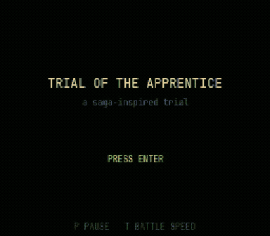

# Trial of the Apprentice

A browser-native, SNES-style turn-based RPG proof of concept — one hero, three mobs, one boss, four rooms, built to nail the feel of a single high-stakes combat/exploration loop.

**The Stolen Emberheart.** The Cloaked Chimera slew Master Corvan and swallowed the Emberheart — the vale's last warm light. The nights are its now; the wisps sing for it. You are Aden, the last apprentice. Take the fire back.

**▶ Play:** https://jrphaeton.github.io/project-apprentice-poc/



## Controls

| Key | Action |
|---|---|
| Arrows / WASD | Move |
| Enter / Z | Interact · confirm · advance text (hold to fast-forward) |
| X / Esc | Cancel (battle submenus) |
| P | Pause |
| T | Battle speed (1×/2×, animation time only) |

Battle commands: **ATTACK · DEFEND · MAGIC · ITEM · RUN**. Defend halves damage this turn **and** powers up your next attack — watch for enemy tells (the spider steps forward before its big bite), defend through the hit, strike back.

## Status: POC complete (M0–M5)

| Milestone | State |
|---|---|
| M0 — Walking skeleton (repo, CI, deploy) | ✅ |
| M1 — Contracts + design lock | ✅ |
| M2 — Vertical slice | ✅ |
| M3 — Combat complete, balance sim green | ✅ |
| M4 — Full stage, final art + audio | ✅ |
| M5 — Polish + release | ✅ |

## Architecture

Phaser 3 + TypeScript (strict) + Vite. The combat core is pure TypeScript with seeded RNG — no Phaser imports — so every battle is replayable headless: golden-replay tests pin full `BattleEvent[]` streams byte-for-byte, and a 1000-seed balance simulation gates every merge (careless play must lose to the boss; correct Defend/buff play must win ≥95%). All balance and content live in `src/data/*.json` behind zod schemas; sprites and audio resolve through manifests, so the art pipeline is a data diff, not a code change. Every sprite and music loop is generated by deterministic in-repo scripts (`tools/`), CC0.

- Design + engineering plan: [`docs/PLAN.md`](docs/PLAN.md)
- Game design doc: [`docs/GDD.md`](docs/GDD.md)
- Release checks: [`docs/RELEASE_CHECKS.md`](docs/RELEASE_CHECKS.md)

## Development

```bash
npm ci             # exact-pinned deps
npm run dev        # http://localhost:8080/project-apprentice-poc/
npm test           # 92 unit tests incl. balance sim + goldens
npm run test:e2e   # 18 Playwright tests vs the built preview
npm run build      # production build
```

CI order (all merge-blocking): lint · typecheck · unit + 90% coverage gate on the combat core · balance sim · goldens · source-asset-lint (grid, palette, manifest integrity, audio durations) · build · size budget (≤ 8 MiB) · E2E incl. initial-load ≤ 3 MiB · deploy · live-URL release gate. Firefox + WebKit run weekly.

Inspired by 1990s SNES JRPGs. All assets self-authored (CC0) — see `assets/CREDITS.md`.
